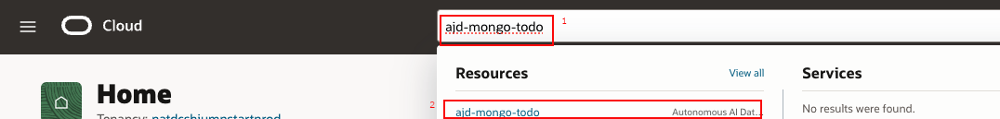
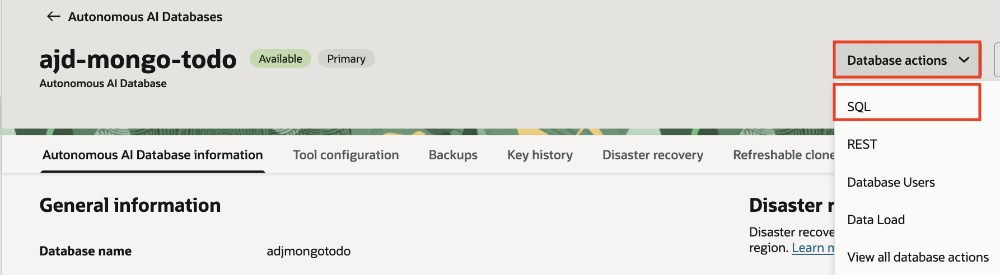
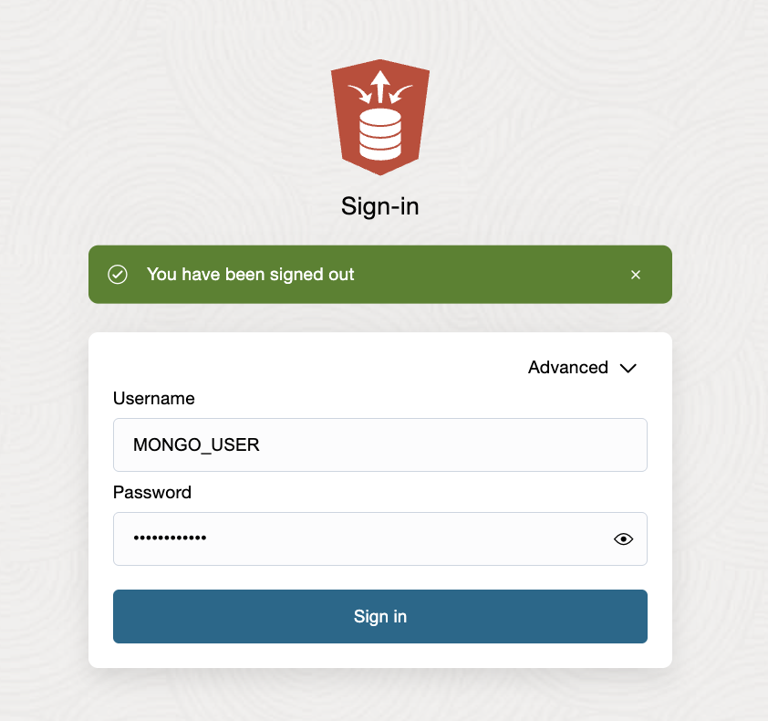
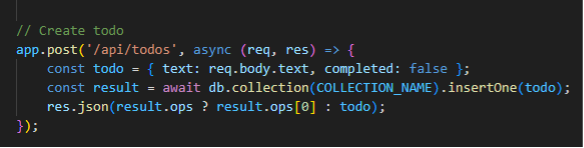

# Lab 4: Prepare Source Data and Analyze

## Introduction

In this lab, you'll insert sample data into your To-Do app running on AJD, review the schema and collections in Oracle SQL Web, and analyze the data to plan the migration to a target collection in the same AJD instance. This step ensures you understand your data before migrating.

> **Estimated Time:** 20 minutes

**Note:** AI-generated output is non-deterministic. The instructions below first provide prompts for you to run in Cline and review the results. If you are not happy with the generated output, use the manual `[Optional]` steps in each task to complete the lab with the tested workflow.

---

### Objectives

In this lab, you will:
- Learn and experiment with using Cline to inspect source data
- Insert sample data via the app UI
- Review the application schema and collections in Oracle SQL Web
- Analyze your source environment and plan the migration

---

### Prerequisites

This lab assumes you have:
- Completed Lab 3 with the To-Do app running
- Access to Oracle Database Actions (SQL Web) for your AJD instance

---

## Task 1: Insert Sample Data

1. Ask Cline to remind you how to start the To-Do app from Lab 3 if it is not already running.

```bash
add prompt: Ask Cline how to start the To-Do app from Lab 3 and what command to run if the server is not already running.
```

*add image: Cline response showing the command to start the Lab 3 To-Do app, ideally including `node server.js`.*

2. Ensure your To-Do app server is running and open the application in your browser.

[Optional] Manually start the server with `node server.js` from your `todo-app` directory and then open `http://localhost:3000`.

3. Ask Cline to suggest a small set of test to-do items that will help you validate create, complete, and delete behavior.

```bash
add prompt: Ask Cline to suggest 3-5 sample to-do items that exercise create, complete, and delete behavior for migration testing.
```

*add image: Cline response listing example to-do items for source data preparation.*

4. Use the To-Do application to enter the suggested items and complete or delete one item so the source data has a mix of states.

*add image: To-Do app in the browser showing the inserted sample tasks, with at least one item completed or deleted.*


---

## Task 2: Review Schema and Collections

1. Ask Cline to remind you how to inspect the `todos_source` collection through Oracle Database Actions and what you should look for in the result.

```bash
add prompt: Ask Cline how to inspect the `todos_source` collection in Oracle Database Actions and what fields to verify before migration.
```

*add image: Cline response describing how to open SQL Web and what to look for in `todos_source`.*

2. In Oracle Database Actions (SQL Web from AJD console):
   - In the OCI Console and search for your database name, open your AJD database.
   

   - Click **Database actions** and launch **SQL** (SQL Web).
   
   - By default you may be logged in as admin, go ahead and sign out.
   
   - Log in to AJD as database user, e.g. **MONGO_USER**.
   
   
   - Run:

     ```sql
     <copy>
     SELECT * FROM todos_source;
     </copy>
     ```

   - Note the schema (e.g., DATA column with JSON: _id, text, completed).

   

   **Why does `todos_source` show up in SQL?**
   When you use the MongoDB API against AJD, documents are stored as JSON and can be exposed through relational views/tables in Database Actions. This lets you query JSON using SQL while still using MongoDB drivers in your application.

Here is how datatabse table created from the code.

   

3. Review the results and confirm the source collection contains the fields you expect for migration.

*add image: SQL Web or notes view confirming the source documents contain `_id`, `text`, and `completed`.*

[Optional] Follow the navigation steps above manually, run `SELECT * FROM todos_source;`, and confirm the JSON-backed rows contain `_id`, `text`, and `completed`.

---

## Task 3: Analyze and Plan Migration

1. Ask Cline to summarize the shape of the source data and propose the migration mapping to the target collection.

```
<copy>
Review the source data for this lab and summarize the migration plan. Identify the key fields in `todos_source`, confirm whether this should be a 1:1 migration to `todos_target`, and note whether any transformations are required.
</copy>
```

*add image: Cline response summarizing the source schema and recommending a 1:1 migration to `todos_target`.*

2. Review the generated summary and capture the final migration approach for the lab.

[Optional] Confirm manually that:
- the source collection contains documents
- the key fields are `_id`, `text`, and `completed`
- the migration will be a simple 1:1 copy from `todos_source` to `todos_target`
- no transformations are required for this workshop

Your source system for the migration example is now ready. Proceed to the next lab.

## Troubleshooting

- **Data Not Appearing:** Ensure the app is connected to AJD and inserts are successful (check server logs).
- **SQL Web Access:** Verify ADMIN credentials and network access.

---

## Acknowledgements

**Authors**
* **Luke Farley**, Senior Cloud Engineer, ONA Data Platform S&E

**Contributors**
* **Cline**, AI Assistant

**Last Updated By/Date:**
* **Luke Farley**, Senior Cloud Engineer, ONA Data Platform S&E, November 2025
