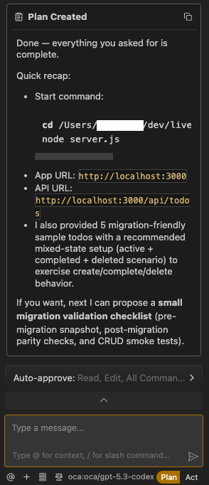
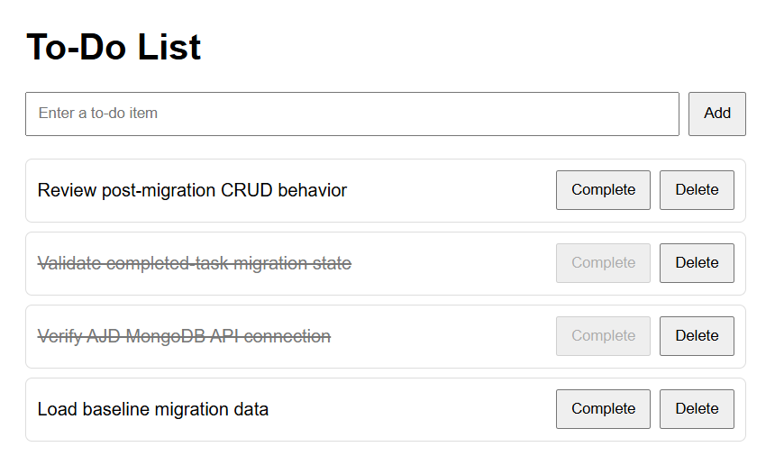
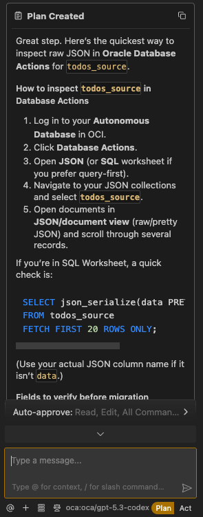
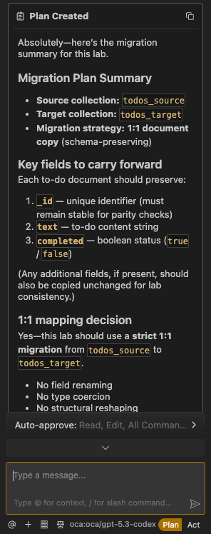

# Lab 4: Prepare Source Data and Analyze

## Introduction

In this lab, you'll insert sample data into your To-Do app running on AJD, review the schema and collections in Oracle SQL Web, and analyze the data to plan the migration to a target collection in the same AJD instance. This step ensures you understand your data before migrating.

> **Estimated Time:** 20 minutes

**Note:** AI-generated output is non-deterministic. The instructions below first provide prompts for you to run in Cline and review the results. If you are not happy with the generated output, use the manual steps in "Acting on the plan" to complete the lab with the tested workflow.

---

### Objectives

In this lab, you will:
- Learn and experiment with using Cline to inspect source data
- Insert sample data via the app UI
- Review the application schema and collections in Oracle SQL Web
- Analyze your source environment and plan the migration

---

### Prerequisites

This lab assumes you have:
- Completed Lab 3 with the To-Do app running
- Access to Oracle Database Actions (SQL Web) for your AJD instance

---

## Task 1: Insert Sample Data

**Goal:** Ensure the application is running and populate the source database with a diverse set of test data.

### 1. Planning: Crafting the prompt

*How to construct this prompt:* Ask the AI assistant for guidance on launching the application built in the previous lab and generating appropriate sample data to exercise the CRUD operations.

```text
<copy>
Hi Cline, please remind me how to start the To-Do app from Lab 3. Also, please suggest 3-5 sample to-do items that exercise create, complete, and delete behavior so we have a good mix of data states for our upcoming migration testing.
</copy>
```

### 2. Reviewing the plan: Checking the AI's proposed implementation

*This screenshot shows the AI providing the startup command and a list of sample tasks.*



### 3. Acting on the plan: Starting the app and entering data

Execute the startup command provided by the AI (e.g., `node server.js` from your `todo-app` directory) and open `http://localhost:3000` in your browser. Use the UI to enter the suggested items and mark at least one as complete and delete another.

### 4. Validating and adjusting: Testing the output

*This screenshot shows the running To-Do app in the browser with the inserted sample tasks.*



## Task 2: Review Schema and Collections

**Goal:** Inspect the data inserted into Oracle AJD using SQL Web to understand how MongoDB JSON documents are stored natively.

### 1. Planning: Crafting the prompt

*How to construct this prompt:* Ask the AI for instructions on how to locate and query the specific JSON collection within Oracle Database Actions.

```text
<copy>
We have inserted our data! Now, I want to review the raw JSON documents. Could you remind me how to inspect the `todos_source` collection in Oracle Database Actions and what fields I should verify before proceeding with migration?
</copy>
```

### 2. Reviewing the plan: Checking the AI's proposed implementation

*This screenshot shows the AI detailing the steps to open SQL Web and run a `SELECT` query on the `todos_source` collection.*



### 3. Acting on the plan: Inspecting the data

1. In the OCI Console, navigate to your AJD database.
2. Click **Database actions** and launch **SQL** (SQL Web). Log out of `admin` if necessary, and log in as your MongoDB user (e.g. `MONGO_USER`).
3. Run the following query snippet in the SQL worksheet:

   ```sql
   <copy>
   SELECT * FROM todos_source;
   </copy>
   ```

   **Why does `todos_source` show up in SQL?**
   When you use the MongoDB API against AJD, documents are stored as JSON and can be exposed through relational views/tables in Database Actions. This lets you query JSON using SQL while still using MongoDB drivers in your application.

### 4. Validating and adjusting: Testing the output

*This screenshot confirms the source documents retrieve successfully, containing `_id`, `text`, and `completed` fields.*


## Task 3: Analyze and Plan Migration

**Goal:** Work collaboratively with the AI to finalize the migration strategy based on the source data footprint.

### 1. Planning: Crafting the prompt

*How to construct this prompt:* Prompt the AI to act as a migration architect, summarizing the structure seen in the previous step and dictating whether a direct transfer or a data transformation is needed.

```text
<copy>
Based on our review, please summarize the migration plan. Identify the key fields in `todos_source`, confirm whether this should be a 1:1 migration to `todos_target`, and note whether any transformations are required for our lab.
</copy>
```

### 2. Reviewing the plan: Checking the AI's proposed implementation

*This screenshot shows the AI summarizing the source schema and correctly identifying that a simple 1:1 migration to `todos_target` without transformations is the optimal approach for this workshop.*



### 3. Acting on the plan: Finalizing the strategy

Review the AI's summary and ensure the team is aligned on the 1:1 copy technique. 

### 4. Validating and adjusting: Readiness check

Confirm that your source system is fully primed with documents containing the required fields. Your source system for the migration example is now ready. Proceed to the next lab.

<!--  -->

---

## Troubleshooting

- **Data Not Appearing:** Ensure the app is connected to AJD and inserts are successful (check server logs).
- **SQL Web Access:** Verify ADMIN credentials and network access.

---

## Acknowledgements

**Authors**
* **Luke Farley**, Senior Cloud Engineer, ONA Data Platform S&E

**Contributors**
* **Cline**, AI Assistant

**Last Updated By/Date:**
* **Luke Farley**, Senior Cloud Engineer, ONA Data Platform S&E, November 2025
