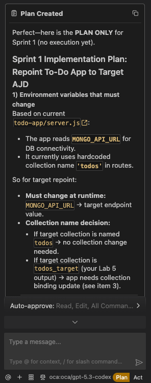
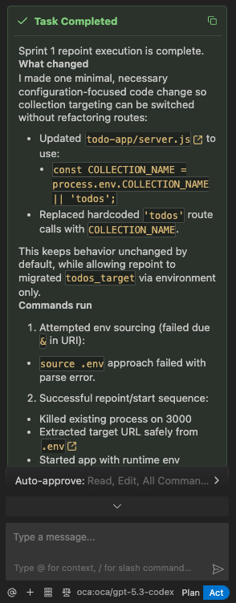
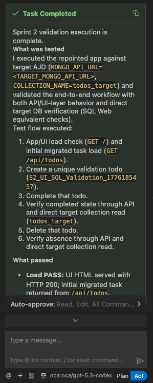
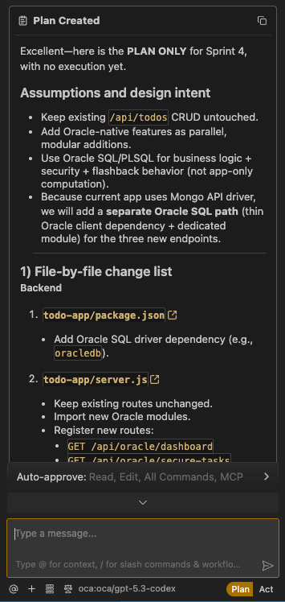
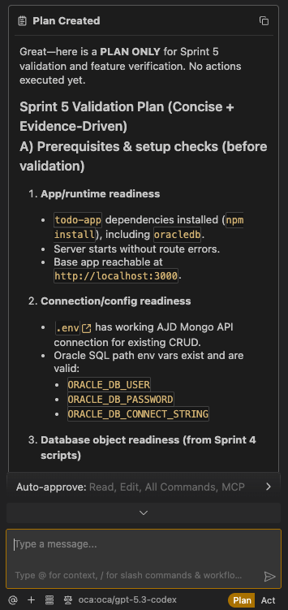

# Lab 6: Validate and Explore AJD Benefits

## Introduction

In this lab, you will validate the migrated To-Do application against the AJD target environment, explore key Oracle AI Database 26ai capabilities, and then add a small set of Oracle-native enhancements to the application.

Just like Labs 3, 4, and 5, you will guide the AI assistant through structured sprints.

We will follow this 4-step workflow:
1. **Planning**: Crafting the prompt.
2. **Reviewing the plan**: Checking the AI's proposed implementation.
3. **Acting on the plan**: Allowing Cline to execute actions after plan approval.
4. **Validating and adjusting**: Confirming outcomes and correcting if needed.

> **Estimated Time:** 30 minutes

**Note:** AI-generated output is non-deterministic. The instructions below first provide prompts for you to run in Cline and review the results. If you are not happy with the generated output, use the manual `[Optional]` steps in each task to complete the lab with the tested workflow.

---

## Objectives

In this lab, you will:
- Use structured AI-assisted sprints to validate a migrated AJD-backed app
- Repoint the app from source to target collection
- Validate CRUD behavior and migrated data integrity
- Explore AJD benefits: security, scaling, monitoring, and AI integration in 26ai
- Translate platform-level Oracle advantages into visible app-level features
- Add feature enhancements to the To-Do app that demonstrate Oracle-native strengths

---

## Prerequisites

This lab assumes you have:
- Completed Lab 5
- The To-Do app from Lab 3
- Migrated data in `todos_target`

---

## Task 1: Sprint 0 — Grounding the AI Session

**Goal:** Establish clear context so the AI assistant understands the app state, migration status, and overall goal of this final lab.

### 1. Planning: Crafting the prompt

*How to construct this prompt:* Ground the AI in your current workshop state and define the sprint sequence for this lab.

Provide this grounding prompt:

```text
<copy>
Hi Cline, we are starting Lab 6 in the AJD Mongo workshop.

Context:
- We already built the To-Do app in Lab 3.
- We analyzed source data in Lab 4.
- We migrated data to `todos_target` in Lab 5.
- We now need to validate the migrated app against the target AJD environment.
- The progression of this lab should flow in three stages:
  1. prove the migrated app works unchanged on AJD,
  2. identify Oracle platform capabilities that matter,
  3. turn those capabilities into visible application features.

For this lab, please use a sprint-based approach:
- Sprint 1: Repoint app config from source to target.
- Sprint 2: Validate app CRUD behavior and data integrity.
- Sprint 3: Explore AJD benefits (security, scaling, monitoring, AI in 26ai).
- Sprint 4: Implement Oracle-advantage feature enhancements in the app.
- Sprint 5: Validate and experience the new feature set.

Please acknowledge the plan and confirm readiness for Sprint 1.
</copy>
```

### 2. Reviewing the plan: Checking the AI's proposed implementation

Confirm the AI response includes:
- Clear awareness of current lab status
- A practical sequence for repoint, validate, and explore
- Explicit readiness to begin Sprint 1

<!-- *add image: Cline response confirming Sprint 0 grounding and readiness.* -->


### 3. Acting on the plan: Aligning the session

Acknowledge the AI plan and proceed to Sprint 1.

### 4. Validating and adjusting: Readiness check

Ensure the AI is scoped to this lab only and does not propose unnecessary refactoring or unrelated tooling.

---

## Task 2: Sprint 1 — Repoint the Application to Target Collection

**Goal:** Switch the running app from source to target AJD collection with minimal changes so we can prove migration compatibility first.

### 1. Planning: Crafting the prompt

*How to construct this prompt:* Ask for the exact environment variables and commands required to repoint safely.

Provide this prompt:

```text
<copy>
Let's start Sprint 1.

Please follow this execution rule:
- First provide PLAN ONLY.
- Do NOT execute commands yet.
- Wait for my explicit approval.
- After approval, execute in Act Mode.

Context:
- The To-Do app from Lab 3 already works against the source environment.
- Lab 5 migrated the data to the target AJD collection `todos_target`.
- In this sprint, the goal is to prove that the same application can run against the migrated target with minimal changes.

Please produce an implementation plan that tells me exactly how to repoint the application from source to target.

Your PLAN should include:
1) Which environment variables must change.
2) The exact export commands needed.
3) Whether `COLLECTION_NAME` must be changed or can remain unchanged depending on naming choice.
4) Any assumptions about how the app currently loads configuration.
5) The exact server restart command needed.
6) A short validation checklist to confirm the repoint was successful.
7) Any likely failure modes, such as a missing environment variable or stale terminal session.

Keep the plan focused on configuration and startup only. Do not propose unrelated code refactoring unless it is absolutely necessary for the app to point to the target collection.

After I approve, execute the repoint steps and report:
- What changed
- What commands were run
- What evidence confirms the app is now pointing at the target
</copy>
```

### 2. Reviewing the plan: Checking the AI's proposed implementation

Verify the AI calls out:
- `SOURCE_MONGO_API_URL` should point to the target URI for this validation run
- `COLLECTION_NAME='todos_target'` (or equivalent collection routing)
- Restart command (`node server.js`)

Before acting on the plan, review it to ensure:
- The application is still using the same AJD-compatible MongoDB connection pattern from Lab 3.
- Only the environment configuration is changing for this validation step.

<!-- *add image: Cline response with repointing commands.* -->


### 3. Acting on the plan: Allowing Cline to execute

Toggle to **Act Mode** and let Cline run the approved Sprint 1 commands:
- `cd path/to/todo-app`
- `export SOURCE_MONGO_API_URL="$TARGET_MONGO_API_URL"`
- `export COLLECTION_NAME='todos_target'`
- `node server.js`

[Optional] If your app uses a different variable name than `SOURCE_MONGO_API_URL`, apply the equivalent target URI variable your app expects.

### 4. Validating and adjusting: Testing the output

Confirm the server starts successfully and no connection errors appear.
 
<!-- *add image: Terminal showing updated env vars and running app.* -->


---

## Task 3: Sprint 2 — Validate Functionality and Data Integrity

**Goal:** Confirm the repointed app works end-to-end and migrated data is intact so we have a trustworthy baseline before exploring Oracle-specific differentiation.

### 1. Planning: Crafting the prompt

*How to construct this prompt:* Ask the AI for a concise checklist covering UI validation plus SQL-side verification.

Provide this prompt:

```text
<copy>
Great, Sprint 2.

Please follow this execution rule:
- First provide PLAN ONLY.
- Do NOT run actions yet.
- Wait for my explicit approval.
- After approval, execute the validation steps in Act Mode.

Context:
- Sprint 1 repointed the app from the source environment to the target AJD environment.
- In this sprint, we need to prove that the migrated application still behaves correctly and that the target data is valid.

Please create a validation plan that confirms:
1) migrated tasks load correctly in the UI, 
2) CRUD operations still work, and 
3) `todos_target` data integrity is verified in SQL Web.

Your PLAN should include:
1) The exact user actions to perform in the browser.
2) The expected UI behavior before and after each action.
3) The SQL query or queries needed to verify the target collection.
4) What to compare between the UI and SQL results.
5) A clear pass/fail checklist for the sprint.
6) The most likely causes if the UI and SQL data do not match.

Keep the validation practical and focused on workshop outcomes. After I approve, execute the checklist and then summarize:
- What was tested
- What passed
- Any discrepancies found
- What should be fixed before moving to Sprint 3
</copy>
```

### 2. Reviewing the plan: Checking the AI's proposed implementation

Ensure the checklist covers:
- Open app at `http://localhost:3000`
- Add, complete, and delete tasks
- Query target collection in SQL Web
- Compare target rows/documents against source expectations

Before acting on the plan, review it to ensure:
- The checklist validates both application behavior and underlying target data.
- The validation still focuses on the migrated `todos_target` collection.

<!-- *add image: Cline validation checklist response.* --> 



### 3. Acting on the plan: Allowing Cline to execute validation

Toggle to **Act Mode** and let Cline execute the approved Sprint 2 validation flow.

1. Open `http://localhost:3000` and verify migrated tasks appear.


2. Test CRUD operations:
- Add a new to-do item
- Mark an item complete
- Delete an item

3. In Oracle Database Actions (SQL Web), run:

   ```sql
   <copy>
   SELECT * FROM todos_target;
   </copy>
   ```

4. Compare with your expected source footprint from Lab 4.

### 4. Validating and adjusting: Testing the output

Pass criteria:
- UI loads target data
- CRUD actions succeed without errors
- SQL results confirm target documents are present and coherent

[Optional] If discrepancies appear, re-run migration scripts from Lab 5 and repeat this sprint.

---

## Task 4: Sprint 3 — Explore AJD Benefits in 26ai

**Goal:** Explore the Oracle capabilities behind the migrated app and identify which ones are most suitable to surface directly in the application in Sprint 4.

### 1. Planning: Crafting the prompt

*How to construct this prompt:* Ask for a practical, workshop-friendly walkthrough of key AJD value areas.

Provide this prompt:

```text
<copy>
Sprint 3: platform exploration and feature selection.

Please follow this execution rule:
- First provide PLAN ONLY.
- Do NOT execute actions yet.
- Wait for my explicit approval.
- After approval, execute the guided exploration in Act Mode.

Context:
- Sprint 1 proved the application can be repointed to the target.
- Sprint 2 proved the migrated application still behaves correctly.
- In this sprint, we want to understand which Oracle AI Database capabilities are worth surfacing directly in the application next.

Please give me a practical walkthrough to explore AJD benefits in Oracle AI Database 26ai for this migrated app, specifically:
- Security
- Scaling
- Monitoring
- AI features (including vector/semantic capabilities)

Your PLAN should include:
1) What I should click or check in OCI for each area.
2) What I should be looking for in each area and why it matters.
3) One useful SQL example against `todos_target`.
4) Which 2-3 Oracle-native capabilities are the best candidates to expose as actual application features in the next sprint.
5) A short recommendation explaining why those capabilities are stronger workshop candidates than generic app enhancements.
6) A short handoff note describing how Sprint 3 findings should drive Sprint 4 implementation choices.

Keep the exploration grounded in what a workshop participant can actually observe and use. After I approve, execute the exploration steps and summarize:
- What was explored
- What Oracle-native capabilities stood out most
- Which capabilities should be implemented in Sprint 4
- Why those choices best support the lab
</copy>
```

### 2. Reviewing the plan: Checking the AI's proposed implementation

Confirm the AI guidance includes:
- Security controls (encryption, ACL posture, auditability)
- Scaling behavior and operational simplicity
- Monitoring metrics to inspect
- AI-oriented exploration ideas relevant to JSON data
- A clear recommendation for which Oracle-native features should be built next in Sprint 4

Before acting on the plan, review it to ensure:
- The recommendations are truly Oracle-native capabilities rather than generic application features.
- The proposed next-step features can be implemented within the scope of this lab.

### 3. Acting on the plan: Allowing Cline to execute guided exploration

Toggle to **Act Mode** and let Cline execute the approved Sprint 3 exploration checklist.

1. **Security:** In OCI, review encryption defaults, access controls, and audit-related settings.
2. **Scaling:** Review auto-scaling options and capacity behavior.
3. **Monitoring:** Inspect metrics such as CPU and storage trends.
4. **AI in 26ai:** Review AI-related database capabilities relevant to document data and semantic workloads.

Run this SQL example:

```sql
<copy>
SELECT
    JSON_VALUE(DATA, '$._id') AS id,
    JSON_VALUE(DATA, '$.text') AS text,
    JSON_VALUE(DATA, '$.completed') AS completed
FROM todos_target;
</copy>
```

### 4. Validating and adjusting: Outcome check

Confirm you can:
- Explain at least one concrete benefit in each area (security, scaling, monitoring, AI)
- Query migrated JSON documents via SQL successfully
- Name the Oracle-native capabilities you will now surface in the application in Sprint 4

At the end of this sprint, the team should be aligned on a simple narrative:
- Sprint 1 proved the app can move to AJD.
- Sprint 2 proved the migrated system still behaves correctly.
- Sprint 3 identified the Oracle capabilities worth turning into visible product features.
- Sprint 4 will implement those features so the value is visible directly in the app experience.

---

## Task 5: Sprint 4 — Build Oracle-Advantage Features

**Goal:** Turn the Oracle platform advantages selected in Sprint 3 into concrete application features that can be tried directly in the app.

### 1. Planning: Crafting the prompt

*How to construct this prompt:* Ask Cline to produce a high-confidence, implementation-ready plan with explicit SQL/PLSQL artifacts, then execute only after approval.

Provide this prompt:

```text
<copy>
Sprint 4: Oracle-native feature implementation.

Please follow this execution rule:
- First provide PLAN ONLY.
- Do NOT run commands or edit files yet.
- Wait for my explicit approval.
- After approval, execute in Act Mode.

Context:
- The app is already migrated and running against AJD target data.
- Sprint 1 proved compatibility.
- Sprint 2 proved correctness.
- Sprint 3 identified Oracle-native capabilities that are worth surfacing directly in the product experience.
- We now want to turn those platform capabilities into visible differentiators in the application.
- Keep existing CRUD behavior intact.

Please implement the following Oracle-native capabilities as the next step coming out of Sprint 3:

1) PL/SQL Business Logic Endpoint (`/api/oracle/dashboard`)
- Create database objects (package/procedure/function as needed) that compute:
  - total tasks
  - completed tasks
  - pending tasks
  - completion percentage
- Return dashboard data as JSON from the API.
- The computation must be done in-database (SQL + PL/SQL), not only in app-side loops.

2) Row-Level Security / VPD Demo (`/api/oracle/secure-tasks`)
- Add tenant/owner context support (for example via request header like `x-user-id`).
- Create and apply an Oracle VPD policy so row filtering is enforced by the database layer.
- Implement endpoint showing policy-enforced results for current context.
- Include safe fallback behavior and clear error message if policy objects are missing.

3) Flashback Time-Travel Demo (`/api/oracle/as-of?ts=...`)
- Implement endpoint that queries task state as-of a supplied timestamp using Oracle flashback query.
- Add UI toggle to switch between current state and historical (as-of) state.
- Validate timestamp parsing and return helpful error responses for invalid formats or retention-window misses.

Architecture and implementation constraints:
- Keep endpoint code modular and easy to read.
- Do not break existing routes.
- Keep Mongo-style app flow where practical, but explicitly call Oracle SQL/PLSQL where needed.
- Add minimal comments only where logic is non-obvious.

Deliverables required in your PLAN response:
1) File-by-file change list (backend, frontend, SQL scripts).
2) Exact SQL/PLSQL objects to create (names, purpose, and execution order).
3) API contracts for each new endpoint (request params, headers, response shape, error shape).
4) Step-by-step execution plan in safe order.
5) Validation checklist mapped to each feature.
6) Rollback/backout notes if a step fails.

After I approve, execute the plan in Act Mode and then report:
- What was changed
- What commands were run
- What verification evidence was captured
- Any follow-up fixes needed
</copy>
```

### 2. Reviewing the plan: Checking the AI's proposed implementation

Confirm the plan includes:
- Backend route updates (server/API layer)
- UI updates for Oracle dashboard + secure view + as-of toggle
- SQL, PL/SQL, and policy setup scripts required for the new endpoints
- Safe fallback behavior if Oracle-specific setup is not yet applied
- A clear connection back to Sprint 3 discoveries and why each implemented feature supports the lab goals

Before acting on the plan, review it to ensure:
- The implementation preserves the existing CRUD workflow from Lab 3.
- The Oracle-native features are clearly separated from the baseline app behavior.
- The proposed database objects and policies are scoped carefully and can be validated within the lab.

<!-- *add image: Cline Sprint 4 implementation plan.* -->


### 3. Acting on the plan: Allowing Cline to execute feature build

Toggle to **Act Mode** and let Cline implement the approved Sprint 4 feature changes.

[Optional] If time is limited, prioritize PL/SQL dashboard first, then row-level security (VPD), then flashback query.

### 4. Validating and adjusting: Testing the output

Validate:
- `/api/oracle/dashboard` returns PL/SQL-computed metrics
- Row-level security endpoint only returns caller-authorized rows
- Flashback endpoint returns valid historical view for a prior timestamp
- UI remains responsive and CRUD still works

---

## Task 6: Sprint 5 — Validate the Oracle Feature Set

**Goal:** Validate the enhanced application end-to-end and confirm the Oracle-native features work as expected.

### 1. Planning: Crafting the prompt

*How to construct this prompt:* Ask for a detailed validation playbook that proves each Oracle-native capability through hands-on product interaction.

Provide this prompt:

```text
<copy>
Sprint 5: validation and feature verification.

Please follow this execution rule:
- First provide PLAN ONLY.
- Do NOT run actions yet.
- Wait for my explicit approval.
- After approval, execute the full validation checklist.

Create a concise validation flow that proves:
1) Core CRUD still works on migrated AJD data.
2) PL/SQL-powered dashboard endpoint updates correctly after CRUD actions.
3) Row-level security policy is enforced by the database (not just app code).
4) Flashback endpoint retrieves prior task state using an earlier timestamp.

Expand this into a detailed validation runbook with:
- Prerequisites and setup checks before validation starts.
- Exact request sequence (including sample curl commands or UI actions).
- Expected output for each step.
- Negative tests (for example unauthorized user context for VPD, invalid timestamp for flashback).
- Pass/fail criteria for each capability.
- A final evidence summary table mapping each claim to proof.

Also provide a short "why Oracle AJD" explanation tied directly to:
- in-database PL/SQL logic
- database-enforced VPD security
- flashback time-travel capability

After approval and execution, return:
1) The final validation flow.
2) A troubleshooting quick-reference for common hands-on failures.
3) A concise summary of the product and business value.
</copy>
```

### 2. Reviewing the plan: Checking the AI's proposed implementation

Confirm the checklist is:
- Step-by-step and easy to follow
- Focused on before/after evidence (counts, security visibility, historical state)
- Mapped to Oracle advantages (PL/SQL, VPD row-level security, flashback query)

Before acting on the plan, review it to ensure:
- The validation covers both successful paths and failure cases.
- The outcomes are concrete enough for a workshop participant to verify independently.

<!--*add image: Cline Sprint 5 validation plan.* -->



### 3. Acting on the plan: Allowing Cline to execute validation flow

Toggle to **Act Mode** and let Cline run the approved Sprint 5 validation sequence.

### 4. Validating and adjusting: Final acceptance check

Pass criteria:
- No regression in CRUD
- New Oracle-native features work end-to-end
- The validation clearly connects app behavior to Oracle AJD strengths

**Congratulations!** You have completed the end-to-end workshop lifecycle: build, analyze, migrate, validate, explore, and extend the app with Oracle-focused feature advantages on Oracle AI Database 26ai.

---

## Troubleshooting

- **No data in app after repoint:** Verify environment variables and restart the server in the same terminal session.
- **Data discrepancies:** Re-run migration from Lab 5 and compare counts before document-level checks.
- **SQL Web query issues:** Confirm you are connected to the correct AJD instance and user context.
- **Analytics mismatch:** Recompute counts from SQL Web and verify the endpoint is using the target collection.
- **Policy not applied:** Re-check VPD policy creation and session context setup before testing secure endpoints.
- **Flashback errors:** Verify timestamp format and ensure undo/retention window covers the requested time.

---

## Acknowledgements

**Authors**
* **Luke Farley**, Senior Cloud Engineer, ONA Data Platform S&E

**Contributors**
* **Cline**, AI Assistant

**Last Updated By/Date:**
* **Luke Farley**, Senior Cloud Engineer, ONA Data Platform S&E, November 2025
